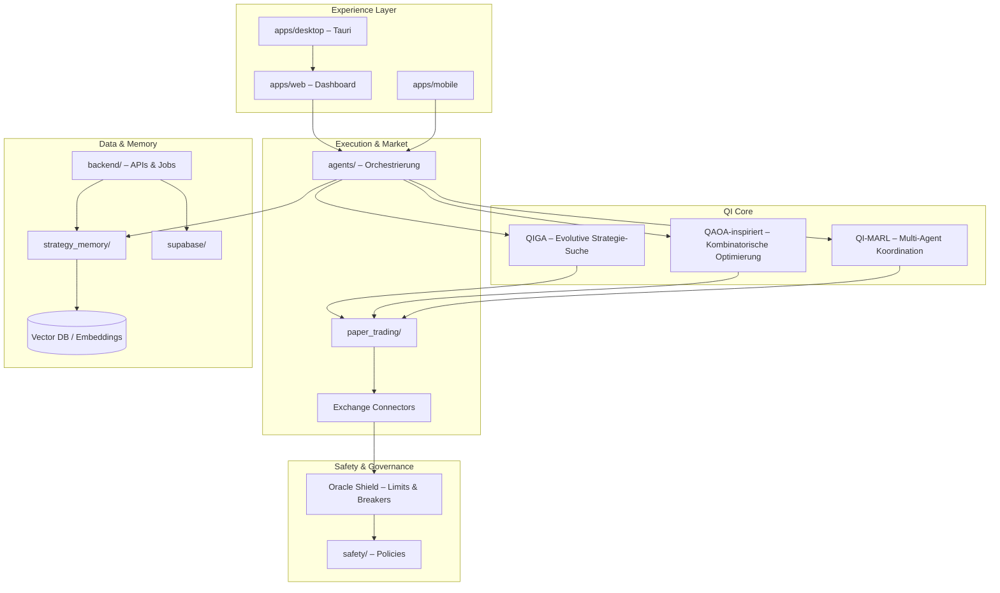

# Aether Trader

**Autonome Strategie-Entwicklung für algorithmischen Handel** – konsolidiert als Monorepo mit quanten-inspirierten Optimierungs- und Lernverfahren als zentralem Entscheidungsmotor.

---

## Vision

Aether Trader verfolgt eine Pipeline von **Forschung → Simulation → abgesichertem Einsatz**: Strategien entstehen und verändern sich autonom unter Einbindung klassischer und **quanten-inspirierter** Methoden. Als Kern dienen drei komplementäre Bausteine:

| Baustein | Rolle |
|----------|--------|
| **QIGA** (Quantum-Inspired Genetic Algorithm) | Evolutive Suche im Strategieraum: Genome, Crossover/Mutation, Fitness über Risiko-adjustierte Kennzahlen und Stabilität unter Regimewechseln. |
| **QAOA** (Quantum Approximate Optimization) – inspiriert | Kombinatorische Entscheidungen (Allokation, Routing zwischen Teilstrategien, Scheduling von Orders) als approximierte Optimierung auf Graphen / Constraint-Strukturen. |
| **QI-MARL** (Quantum-Inspired Multi-Agent Reinforcement Learning) | Mehrere spezialisierte Agenten (Research, Execution, Risk) koordinieren sich mit geteilten Zielen und begrenzter Informationsaustausch – quanten-inspirierte Repräsentationen und Sampling-Mechanismen unterstützen Exploration in hochdimensionalen Zuständen. |

Ziel ist kein „Black-Box-Signal“, sondern **nachvollziehbare** Strategieiteration mit klaren Safety-Grenzen und reproduzierbaren Paper-Phasen, bevor Kapital exponiert wird.

---

## Wichtige Features

- **Paper-Trading-Lernphasen**  
  Getrennte Umgebungen für Backtest, Walk-Forward und Live-Paper: gleiche Schnittstellen zu Börsen-Connectors, deterministische Seeds wo möglich, Logging für Strategie-Gedächtnis und Audits.

- **Safety Layer mit Oracle Shield**  
  Circuit Breaker, Drawdown- und Volatilitäts-Limits, Positions- und Exposure-Caps, News-/Liquidations-Trigger und manuelle Not-Stufen; Entscheidungen des QI-Stacks werden nur freigegeben, wenn Policy- und Risiko-Gates grün sind.

- **Technisch orientiertes Dashboard**  
  Web- und Desktop-Oberflächen für GSM-/Strategie-Visualisierung, Orderflow- und Korrelationsmetriken, Agenten-Status, Safety-Overlay und Journale – ausgelegt für Operatoren und Forschung, nicht nur für Marketing-Metriken.

---

## Tech-Stack und Monorepo-Aufbau

| Bereich | Technologie / Ort |
|---------|-------------------|
| **Web** | Solid.js, Vite, TypeScript → `apps/web/` |
| **Mobile** | Expo, React Native → `apps/mobile/` |
| **Desktop** | Tauri 2, Rust (Shell) → `apps/desktop/` |
| **Agents & Orchestrierung** | TypeScript → `agents/` (Migration in Pakete möglich) |
| **Backend & Services** | Python ≥ 3.11, APIs, Worker → `backend/` (Ausbau) |
| **Quanten-inspiriert** | Algorithmen, Experimente → `quantum_inspired/` |
| **Safety & Paper** | Policies, Simulation → `safety/`, `paper_trading/` |
| **Strategie-Gedächtnis** | CRDT / Logs / Embeddings → `strategy_memory/` |
| **Infrastruktur** | IaC, Deploy → `infrastructure/` |
| **Gemeinsame Pakete** | `packages/` |
| **Edge / DB** | Supabase → `supabase/` |
| **Tooling** | pnpm Workspaces, Turborepo (`pnpm-workspace.yaml`, `turbo.json`) |

Python-Metadaten und optionale Dev-Tools: `pyproject.toml`.

---

## Architektur (High-Level)



---

## Setup

### Voraussetzungen

- **Node.js** ≥ 18 (empfohlen: 22 LTS)
- **pnpm** (Version siehe `packageManager` in Root-`package.json`)
- **Python** ≥ 3.11 (Backend-Skripte und spätere Services)
- Optional: **Rust** (für `apps/desktop` / Tauri-Builds)

### Installation

```bash
git clone https://github.com/macyb27/aether_trader_final.git
cd aether_trader_final

# Abhängigkeiten (Workspaces)
pnpm install

# Web-App
pnpm --filter aether-trader-omega install
pnpm dev:web
# → typischerweise http://localhost:3000 (siehe apps/web)

# Mobile (Expo) – nur bei Bedarf
pnpm dev:mobile
```

Python-Umgebung (Beispiel):

```bash
python -m venv .venv
source .venv/bin/activate   # Windows: .venv\Scripts\activate
pip install -e ".[dev]"     # sobald installierbare Pakete im Backend ergänzt sind
```

### Environment

```bash
cp .env.example .env
# Werte für Supabase, Exchange-Testkeys, LLM und Vector-DB setzen (siehe Kommentare in .env.example)
```

Apps können zusätzlich eigene `.env`-Dateien unter `apps/web` oder `apps/mobile` erwarten – dort jeweils die App-Dokumentation prüfen.

### Erster Paper-Trading-orientierter Lauf

1. Exchange- und Daten-APIs in `.env` mit **Testnet / Paper** konfigurieren (keine Live-Keys).  
2. Web-App starten (`pnpm dev:web`) und im UI den **Paper- / Simulationsmodus** wählen, sofern verfügbar.  
3. Optional CLI-Backtest (Pfade an Monorepo angepasst):

   ```bash
   pnpm exec tsx scripts/backtest-cli.ts <pfad-zur-csv>
   ```

Bis zur vollständigen Verdrahtung von `paper_trading/` und Safety-Policies dienen diese Schritte als **Entwicklungs- und Smoke-Tests**; produktive Live-Schaltung ist nicht Ziel dieses Repos in der Konsolidierungsphase.

---

## Roadmap (Kurzüberblick)

1. **Konsolidierung** – Paketgrenzen, Imports, CI für alle Apps; Backend-Python-Paket unter `backend/`.  
2. **QI-Pipeline** – QIGA/QAOA-inspiriert/QI-MARL als klar versionierte Module in `quantum_inspired/` mit reproduzierbaren Experimentconfigs.  
3. **Paper → gated Live** – Oracle Shield als Pflichtpfad; Feature-Flags und Kapital-Limits.  
4. **Strategy Memory** – Embeddings, Journale, Retrieval für Agenten- und Mensch-in-the-Loop-Reviews.  
5. **Hardening** – Observability, Chaos-Tests für Connector-Ausfälle, Compliance-Dokumentation.

---

## Work in Progress

**Work in Progress** – dieses Repository entsteht durch **Konsolidierung von fünf bisher getrennten Repos**. Pfade, APIs und Namenskonventionen können sich zwischen Releases ändern. Für produktive oder kapitaltragende Nutzung ist ausdrücklich eine eigene Risiko- und Rechtsprüfung erforderlich.

**Referenz-Repository:** [github.com/macyb27/aether_trader_final](https://github.com/macyb27/aether_trader_final) – alle Klon- und Remote-Befehle beziehen sich auf dieses Repository.

---

## Weiterführend

- Entwicklungs- und Sicherheitsrichtlinien: **[DEVELOPMENT.md](./DEVELOPMENT.md)**
