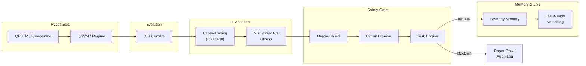

# Aether Trader

**Aether Trader** ist ein **autonomer, quantum-inspirierter Super-Bot** für algorithmischen Handel: er kombiniert Hypothesen (Forecasting & Regime-Erkennung), evolutionäre Strategie-Suche (**QIGA**), realistisches **Paper-Trading**, Multi-Ziel-Fitness und einen **Safety-First**-Gatekeeper (Oracle Shield, Circuit Breaker, Risk Engine). Nur Strategien, die **alle** Prüfungen bestehen, werden als **live-ready** vorgeschlagen und im **Strategy Memory** versioniert.

Dieses Repository ist das **finale Monorepo** (Konsolidierung mehrerer Vorgänger-Repos). Ziel ist eine durchgängige Pipeline von Forschung bis gated Live-Einsatz – nicht ein einzelnes Skript, sondern ein wartbares System mit klaren Grenzen.

---

## Vision: Der Super-Bot

1. **Hypothesis & Marktverständnis** – QLSTM-ähnliches Forecasting und Regime-Klassifikation (QSVM/VQC-Pfade) liefern Kontext und Risiko-Hinweise für die Evolutionsphase.  
2. **Evolution** – **QIGA** erzeugt und verfeinert Strategie-Chromosome mit quanten-inspirierten Operatoren (Rotation, Entanglement-Metriken) und Multi-Objective-Fitness.  
3. **Simulation** – **Paper-Trading** (konfigurierbar, Standard z. B. 30 Handelstage) bewertet jede Kandidatenstrategie unter realistischen Annahmen.  
4. **Governance** – **Oracle Shield**, **Circuit Breaker** und **Risk Engine** bilden den letzten Schutzwall: keine Live-Freigabe ohne vollständige Checks.  
5. **Gedächtnis** – erfolgreiche oder lehrreiche Läufe landen im **Strategy Memory** (Vektor-Store / Metadaten) mit Explainability.  
6. **Zukunft** – Backend-Switch `classical` → `pennylane` / `qiskit` in `core/quantum_backend.py` vorbereitet, ohne die klassische Pipeline zu brechen.

---

## Autonomer Super-Bot-Loop (End-to-End)



**Safety-First:** Schlägt ein beliebiger Schritt fehl oder liefert harte Verletzungen, bleibt das System im **Paper-Modus** und protokolliert Gründe (strukturierte Logs unter `aether.pipeline` / `aether.safety`).

---

## Monorepo-Struktur (Überblick)

| Pfad | Inhalt |
|------|--------|
| `apps/web/` | Solid.js + Vite – technisches Dashboard |
| `apps/mobile/` | Expo / React Native |
| `apps/desktop/` | Tauri 2 + Rust – Desktop-Shell |
| `core/` | Zentrale **Settings**, **Logging**, **Quantum-Backend-Switch** |
| `agents/` | Python-Orchestrierung + TS-Agenten (Legacy) |
| `quantum_inspired/` | QIGA, QAOA-inspiriert, QLSTM, … |
| `safety/` | Oracle Shield, Circuit Breaker, Risk Engine |
| `paper_trading/` | Paper-Simulationen, Fixtures |
| `strategy_memory/` | Persistenz / Vector Store |
| `backend/` | APIs & Worker (Ausbau) |
| `infrastructure/` | IaC, Deploy |
| `packages/` | gemeinsame Bibliotheken |
| `scripts/` | Hilfsskripte |
| `tests/` | Pytest & weitere Tests |
| `docs/` | Zusätzliche Dokumentation |
| `supabase/` | Edge Functions & Schema (optional) |
| `.github/workflows/` | CI (z. B. Mobile-APK) |

---

## Tech-Stack

- **Frontend:** Solid.js, Vite, TypeScript (`apps/web/`)  
- **Mobile:** Expo (`apps/mobile/`)  
- **Desktop:** Tauri 2, Rust (`apps/desktop/`)  
- **Python:** ≥ 3.11 – QIGA, Safety, Orchestrator (`pyproject.toml`, Pakete `core`, `quantum_inspired`, `safety`, `agents`)  
- **Tooling:** pnpm Workspaces, Turborepo  

---

## Setup

```bash
git clone https://github.com/macyb27/aether_trader_final.git
cd aether_trader_final

pnpm install
cp .env.example .env

# Web
pnpm dev:web

# Python (Beispiel)
python3 -m venv .venv && source .venv/bin/activate
pip install numpy pydantic pydantic-settings
PYTHONPATH=. python3 -m agents.orchestrator
```

*(Falls dein Klon noch leer ist: nutze dieses Repository als Vorlage oder pushe den aktuellen Stand nach `aether_trader_final` – siehe unten „Sync“.)*

---

## Roadmap

1. Vollständige QML-Pipeline (QLSTM + QSVM/VQC) an den Orchestrator koppeln.  
2. Kontinuierlicher autonomer Loop (`run_autonomous_loop.py`) mit konfigurierbaren Intervallen.  
3. Dashboard: Live-Pipeline-Status, Quantum-Metriken, Strategy-DNA.  
4. Echte QC-Backends (PennyLane/Qiskit) hinter `core/quantum_backend.py`.  
5. Produktions-Hardening: Observability, Secrets-Management, Compliance-Doku.

---

## Work in Progress

Konsolidierung aus mehreren Vorgänger-Repos; APIs und Pfade können sich noch ändern. **Keine Anlageberatung.** Eigenes Risiko- und Rechtsreview für Live-Handel.

- Entwicklungsregeln: **[DEVELOPMENT.md](./DEVELOPMENT.md)**  
- Referenz-Remote (falls abweichend): [github.com/macyb27/aether_trader_final](https://github.com/macyb27/aether_trader_final)

---

## Sync in ein leeres `aether_trader_final`

Wenn **github.com/macyb27/aether_trader_final** noch leer ist, nach dem ersten Push dieses Stands:

```bash
git remote add final https://github.com/macyb27/aether_trader_final.git
git push -u final main
```

(bzw. `git push -u final <dein-branch>:main` mit `--force` nur nach expliziter Absprache).
